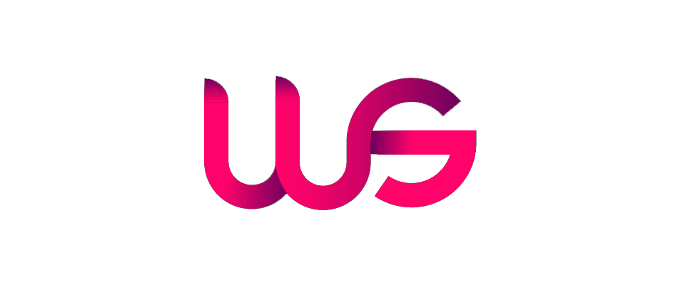

# Web Syntax

#### A web consultancy

# Table of contents
## 1. Project Overview
## 2. UX
* Design Process
* UX research and persona creation
* User stories
* Low fidelity wireframing
* High fidelity prototype
* Design choices
    * Fonts
    * Icons
    * Colours
## 3. Technologies
## 4. Features
* Features that have been developed
* Features that will be implemented i the future
## 5. Testing
## 6. Bugs
## 7. Developement
## 8. Credit 

# 1. Project Overview 
The goal of this project was to create a website for a web consultancy called Web Syntax. Web Syntax is a consultancy that provides services such as web design, re-design and internet marketing strategies. They aim to target businesses with poor online presence and provide them with the knowledge to fully understand what they need to drive an adequate level of website traffic and conversion.

# 2. UX
## *2.1 Design Process*
* UX research and persona creation
* Low fidelity wireframing
* High fidelity prototyping
* Accessibility
* User testing
* Web development

## *2.2 UX research and persona creation*
Research was carried out to identify the specific target users of the site. Three user types were identified, and an individual persona was created for each type. The aim of the personas was to help understand the users’ needs, experiences, behaviours and goals.

## *2.3 User Stories*
* As a user, I want to be informed about what services the company provides.
* As a user, I want to know the pricing for services provided.
* As a user, I want to see examples of previous work.
* As a user, I want to be able to view the company’s social media pages.
* As a user, I want to be able to make an enquiry about potential services.

## *2.4 Low fidelity wireframing*
Balsamiq wireframe software was used to create rough website layouts that were shared with the client. This allowed me to explore several different design options before deciding on a final design structure. The planning was carried out with responsive design in mind, starting with mobile first and graduating to desktop screen size.

Included wireframes:
* Mobile
* Tablet
* Desktop

## *2.5 High fidelity prototype*
The high-fidelity process was started by creating mood boards to get inspiration for the feel, look and mood of the design. The hi-fi prototypes cover not only the user interface (UI) of the product in terms of visuals and aesthetics, but also the user experience (UX) aspects in terms of interactions, user flow and behaviour.

## *2.5 Design choices*
To get design ideas for this site, mood boards were created from content on three sites, Dribble, Niice and Behance. The aim was to design a website that was both aesthetically pleasing and user friendly.    

### *Colour Scheme*
The colour palette for the websites theme was inspired by a combination of themes on Color Hunt. Color Hunt is a website that suggests different colour palettes that go well together.

### *Fonts*
Font sizes were chosen with the help of a type scale visual calculator. The calculator provided an appropriate progression of font sizes.

### *Images*
The images used on the site were taken from unsplash, a website that provides royalty free images and Dribbble, a website that showcases creative work from design professionals. The high-resolution images were selected to suit the theme of the site. Adobe Photoshop was used to crop and resize the images. 

# 3. Accessibility
There are several accessibility best practices used in the design of this website. The first of these is colour contrast, specifically the contrast between text colour and its background. This contrast was considered when choosing an appropriate colour palette at the start of the project. The colours were also run through an online accessibility colour checker to ensure they complied.

The second aspect that was considered was the effective visual focus indicators. To ensure optimal visual focus, the hover state colours were reused for the focus colours, text decoration: underline was used in certain areas and both background-colour and text-colour were also used to create a much more accessible site.

The third area that was considered was the image media text equivalent or ‘ALT’ text. This was to ensure users using screen readers can effectively hear what images are on the site.

# 4. Web Development 

## *4.1 MetaData*
To ensure the correct information is being conveyed to the search engine and to make the website more SEO friendly, several specific meta tags were added.

## *4.2 Semantic HTML*
The use of semantic HTML was deemed critical from the outset.  This was to provide assistive technology with functionality and easy access to page content. It also ensured that search engines could index the content efficiently and in turn provide an improved SEO ranking. The content of the website was Initially broken down into primary and secondary content. This helped to create an initial document outline and assign a hierarchy for the elements. 

## *4.3 Image sizing*

# 5. Features

## *5.1 Existing features*
* Navigation bar at the top of each page that allows users to navigate through the site.
* Hyperlinks in the navigation of the website that redirect the user to the appropriate page of information.
* Social media links that redirect the user to the company’s social media site pages.
* Contact form that allows the user to fill out their personal contact details and send a query.
* The site uses Google Maps API for directions to the business. (It’s a Google Maps developer version so the user will not have full use of the service)

## *5.2 Features still to implement*
* User log in for customer accounts
* Mailchimp API integration for newsletter mailing list

# 6. Technologies

## *6.1 Software*
* [Balsamiq wireframes to produce low fidelity wireframes.](https://balsamiq.com/)
* [Adobe XD to produce high fidelity prototype and carry out user testing.](https://www.adobe.com/products/xd.html#)
* [Adobe Illustrator to create SVG files and the individual personas.](https://www.adobe.com/lu_en/products/illustrator.html#)
* [Adobe Photoshop to edit project images.](https://www.adobe.com/ie/products/photoshop.html#)
* [Visual Studio Code text editor to write my development code in.](https://code.visualstudio.com/)

## *6.2 Languages*
* HTML
* CSS
* JavaScript
* jQuery

## *6.3 Tools & Libraries*
* Google fonts CDN
* Font Awesome CDN
* Bootstrap
* Git
* Google Maps API

# 7. Testing

## *7.1 Prototype testing*
The initial testing phase started by publishing the Adobe XD prototype. A link was the sent via email to a group of selected users who tested the website and later provided feedback on the performance. Amendments were made based on the user feedback.

## *7.2 Web development testing

### *Validators*
* Html mark-up and CSS styles were validated using the W3C Markup validator.
* The initial testing phase started by publishing the Adobe XD prototype. A link was the sent via email to a group of selected users who tested the website and later provided feedback on the performance. Amendments were made based on the user feedback. 
* AcChecker was used to check the overall accessibility of the HTML.

### *Corrected Warnings*
* Section lacks heading. Consider using h2-h6 elements to add identifying headings to all sections.
* Article lacks heading. Consider using h2-h6 elements to add identifying headings to all articles.
* Consider using the h1 element as a top-level heading only (all h1 elements are treated as top-level headings by many screen readers and other tools).

### *Corrected Errors*
* No space attributes.
* The value of the for attribute of the label element must be the ID of a non-hidden form control.
* Saw < when expecting an attribute name. Probable cause: Missing > immediately before.
* Duplicate attribute class.
* Attribute < img not allowed on element section at this point.
* Attribute alt not allowed on element section at this point.

### *Browsers*
The website was tested on the four most used browsers Chrome, Safari, Internet Explorer and Firefox, according to [W3Counter](https://www.w3counter.com/globalstats.php).  There were minimal differences between the browsers. The CSS style backdrop-filter doesn’t seem to be supported on any browser other than Chrome.

### *Responsivness*
Responsive design is used throughout this website. This was achieved with a combination of Bootstrap, CSS Grid, CSS Flexbox and media queries. The media queries changed the screen layout as the screen size changed.

### *Form Validation*
The contact form was designed with in-built validation. The HTML ‘required’ property was used to create mandatory fields in the form.  By catching invalid data on the client-side, the user can fix it straight away.

# 8. Bugs
There were several bugs encountered throughout the development of this project. There were three tools that were key to fixing these issues. Chrome developers’ tools, Firefox developers’ tools and VS Codes linter extension. Below are some of the bugs encountered;

## *During development*
* Bootstrap Navbar
    * Issue with positioning the brand logo
    * Issue with link hover animation
* Bootstrap carousel
    * Issues centring content
    * Issues changing the slider control icons
* Hero image
    * Issues with positioning the hero image
* Portfolio image alignment
    * Used bootstrap cards to solve the issue

## *During testing*
* HTML validation
    * Several sections were flagged as a warning by the HTML validator because the were missing headings. I ignore these because I didn’t consider this a major issue.

# 9. Deployment
Web Syntax was developed in VS Code and I used Git for version control on my local server. It was later pushed into a repository on GitHub. The website was deployed both on GitHub Pages and my own personal domain. The steps taken for deployment are as follows;

## *9.1 GitHub Pages*
* Opened up GitHub in the browser.
* Signed in using username and password.
* Selected my repositories.
* Navigated to Web Syntax.
* In the top navigation clicked settings.
* Scrolled down to the GitHub Pages area.
* Selected Master Branch from the Source dropdown menu.
* Clicked to confirm my selection.
* The site is now live on GitHub Pages

## *9.2 Personal Domain*
* The site is also hosted on my own personal domain (www.websyntax.co.uk).
* The domain name was registered on Register365.com.
* The site is hosted by HostGator.
* The HostGator nameservers were added to my Regisister365 account.
* All files the added to my HostGator file manager.

# 10. Credits
## *10.1 MetaData*
1. MDN web docs - https://developer.mozilla.org/en-US/docs/Web/HTML/Element/meta
2. Joelonsoftware.com - https://www.joelonsoftware.com/2003/10/08/the-absolute-minimum-every-software-developer-absolutely-positively-must-know-about-unicode-and-character-sets-no-excuses/
   
## *10.2 Semantic HTML elements*
1. W3.org - https://www.w3.org/TR/2012/WD-html-markup-20121025/elements-by-function.html

## *10.3 Favicon*
1. Manytools.org - https://manytools.org/http-html-text/favicon-generator/
   
## *10.4 Accessibility*
1. WebAIM Colour Contrast Checker - https://webaim.org/resources/contrastchecker/
2. W3C Accessibility - https://www.w3.org/standards/webdesign/accessibility

## *10.5 Design Inspiration*
1. Behance - https://www.behance.net/
2.  Niice - https://niice.co/
3.	Dribble - https://dribbble.com/

## *10.6 Colour Palette*
1. Color Hunt - https://colorhunt.co/

## *10.7 Images*
1.	Unsplash - https://unsplash.com/t/nature
2.	Pexels - https://www.pexels.com/
3. Dribbble - https://dribbble.com/

## *10.8 Fonts*
1.	Type Scale - https://type-scale.com/
2.	Google Fonts - https://fonts.google.com/

## *10.9 Content*
